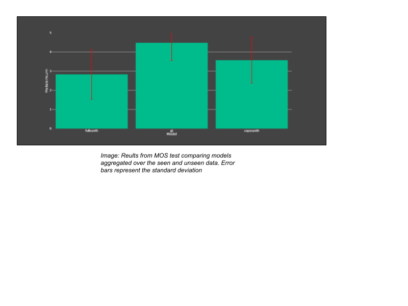

# Subjective evaluation of T13. M9

## Experiment 
### Introduction
The quality of the voices generated in T13 (for Milestones 8 and 9) is evaluated using mean opinion score (MOS) from listening tests. The setup of the speech synthesizer is described in the T13 section. Here, we describe the evaluation methodology and the results obtained. We also summarize the results and draw the main conclusions.

### Evaluation Methodology
Four design variables were examined, resulting in a test set of 144 utterances. These were:
* Two TTS male and female voice models trained on 18 and 17 of the voice donors in the evenly split 40 speaker set Talrómur 2 (See T2).  
* Two types of voices were generated depending on whether they were used in the training set (“seen”) or not (“unseen”).
* Three levels of synthesis: ground truth, copy-synthesized and fully synthesized.  The ground-truth utterances are simply the recordings from the Talrómur 2 dataset, the copy-synthesized utterances were generated using a recording from the dataset (and not the sentence text) and the appropriate target speaker x-vector and the fully synthesized utterances were generated using the full adaptive TTS system.
* Twelve sentences containing linguistically diverse sounds. None of them were used during training.

We recruited 47 listeners, each of which evaluated 24 utterances sampled in a latin-square manner from the list of 144 utterances. The sentences are presented so each participant should only see each text prompt once. 4 text prompts are shared between the female and male voices, so that 10 male voices with distinct text prompts, 10 female voices with distinct text prompts and 4 shared male and female text prompts resulted in 24 utterances that each listener rated.

The listeners were asked to rate each utterance from 1-5 according to how natural it sounds.  The precise instructions were in Icelandic: “Gefðu röddinni einkunn á kvarðanum 1 til 5 eftir því hversu eðlileg þér þykir hún þar sem 1 er mjög óeðlileg og 5 er mjög eðlileg.” 

The participants were allowed to use any device, but were encouraged to use good quality headphones. They were instructed to listen to the full voice clip and to listen to the voice clip as many times as was necessary before rating the naturalness.

The MOS test was sent out to language technology practitioners and staff members of the Icelandic audiobook library, which have experience in taking TTS listening tests before. There were 49 participants in total, 23 male listeners and 26 female listeners, all of them native Icelandic speakers. 

### Results
We calculate the aggregate mean scores over the models, seen and unseen, and ground truths. The model results can be seen in the table below.

Plotting these results in a bar chart yields the following chart, with the error bars plotted as the standard deviation. We can see that the ground truth is rated very high, as it should be. The copy synthesis models are scoring similarly, around 3.5 mean rating. Interestingly, the seen full synthesis model is scoring lower than the unseen full synthesis model.

If we aggregate over the seen and unseen variables, we get the results presented in the table below.

Plotting these results in a bar chart yields the following chart with the error bars plotted as the standard deviation. We can see that the ground truth is again rated high, as is expected. The copy synthesis is scoring around 3.5 mean rating and the full synthesis is scoring around 2.9.

### Summary and conclusions
As expected, the ground truth scored highest overall, with 4.48 mean opinion score.  The number is in line with ground truth scores measured in other work, suggesting that our recordings are of similar quality to those used in other TTS systems.
There is a considerable drop in the evaluation for the copy-synthesis voices, suggesting that the vocoding system could be improved. This is however also observed in many other TTS systems.

## Authors
* Gunnar Thor Örnólfsson
* Jón Guðnason
* Stefán Gunnlaugur Jónsson
* Þorsteinn Daði Gunnarsson
